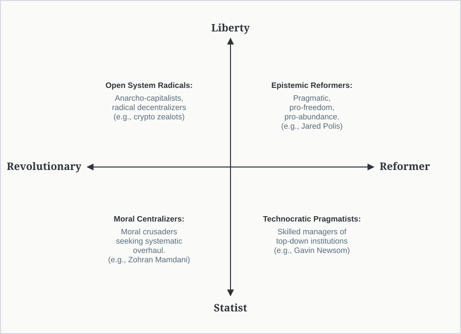
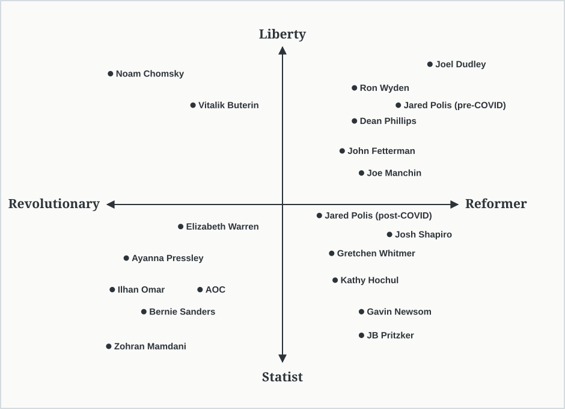

## Executive Summary

This document is my attempt to build a political home for people who want progress without authoritarianism. Many Americans feel politically homeless right now. You can see it plainly in my own state: in Colorado, registered independents outnumber both Democrats and Republicans. I think most of those disaffected voters want roughly the same things: a society that's fairer, freer, more inventive, and more humane. What they don't want is censorship, ideological purity tests, centralized control, permanent culture war, or a politics that treats disagreement as evil or dangerous.

Part of the problem is that American politics has fallen into a cycle of dueling populisms. Right-wing populism provokes left-wing populism, which then fuels another reaction from the right, and so on. Each side increasingly justifies its own excesses by pointing to the excesses of the other. The result is a destructive pendulum swing that undermines the conditions for progress. Here I present a political framework I call Liberty Progressivism, which is my attempt to offer a path out of that partisan tailspin and back toward open-ended progress.

Liberty Progressivism starts from a simple premise: freedom is not a barrier to progress. Freedom is how progress happens. I have often called myself a "classical liberal", but I've come to realize that label is incomplete. I believe in individual liberty, open inquiry, and distributed power. But I also believe society can and should get better. The goal is to protect the conditions that allow the future to improve. Much of modern progressivism has drifted from this insight. Too often, it treats certain outcomes as morally settled and treats dissent as a threat. Liberty Progressivism rejects that mistake. It protects, ahead of any particular outcome, the conditions for progress by which a society corrects itself.

This framework is strongly influenced by philosopher Karl Popper and physicist David Deutsch. Popper's critical rationalism begins from the fact that human beings are fallible: we are often wrong, but we can discover our errors and correct them. Deutsch extends this into a broader view of progress: human beings are universal problem-solvers. In *The Beginning of Infinity*, Deutsch describes progress as an open-ended process of conjecture and criticism. We encounter a problem, make a bold guess about how to solve it, try hard to find the flaws in that guess, and improve what survives. That loop drives progress of every kind: scientific, technological, political, and moral. But it only works in a culture that protects criticism and relies on persuasion rather than coercion. Persuasion lets people expose errors and improve ideas. Coercion suppresses criticism and traps society inside bad solutions.

That openness matters because the problems never stop coming, and solving one problem typically begets others. Deutsch's optimism is the sober and rational kind: every problem is soluble with the right knowledge, and every solution uncovers the next problem. There's no final state to install and no utopia to lock in, only a better problem than the one before. So the real job of politics isn't to enforce the right answers. It's to keep a society capable of finding them, again and again, because the next problem is always coming.

## Defining Progressive vs. Conservative

Before defining Liberty Progressivism, it is useful to clarify what I mean by "progressive" and "conservative." These terms are often used as tribal labels, but at their best they describe different instincts about change, tradition, and social improvement.

Progressives tend to emphasize improvement through change. They believe human knowledge, technology, institutions, and social norms can be revised to reduce suffering and expand opportunities. Progressives are usually more willing to challenge inherited customs when those customs appear unjust, ineffective, or outdated. At their best, progressives see society as a problem-solving project: imperfect, revisable, and capable of becoming better than it is today.

Conservatives tend to emphasize stability through continuity. They believe long-standing customs, moral norms, and institutions often preserve time-tested social knowledge that should not be discarded casually. In this sense, conservatism can function like a cultural filtering process: it protects institutions that have proven workable until there is a strong reason, and a compelling replacement, for changing them. At their best, conservatives remind us that reform should not merely identify flaws in the existing system; it should also explain what working functions might be lost, and how a proposed change would preserve or improve them.

Put simply, progressives are more likely to ask, "What needs to change?" Conservatives are more likely to ask, "What is working that we should not casually destroy?" In my opinion, a healthy society needs smart and creative people asking both questions. Change without criticism can become an uncorrectable error. Preservation without criticism can become stagnation.

This document focuses on progressivism because that is the tradition I identify with and the tradition I am trying to reform from within. The central question is not whether progress is desirable. I believe it is. The central question is what actually makes progress possible. Liberty Progressivism argues that progress depends less on enforcing morally approved outcomes from above and more on protecting the open systems that allow societies to discover and correct their errors.

## The Core Contention of the Modern Progressive Schism

Progressivism, at its best, is an orientation toward open-ended improvement. It begins from the belief that society is not fixed, that suffering can be reduced, that institutions can be reformed, and that the future can be better than the past. But progress does not happen simply because people hold morally desirable goals. Progress happens through learning: noticing problems, proposing solutions, criticizing those solutions, testing them against reality, and improving what survives. A progressive movement that loses that learning process eventually loses its claim to progress.

This, I believe, is where much of modern progressivism has regressed. Too often, it treats certain outcomes as morally settled and treats dissent as a threat. The result is that the process of criticism and knowledge-generation gets subordinated to the protection of approved conclusions.

This regressive pattern appears across several of today's key issues:

- **Speech and dissent:** Some progressives increasingly treat offensive, unpopular, or heterodox ideas less as claims to be debated and more as harms to be managed. University bias-response systems, institutional speech codes, and pressure campaigns aimed at suppressing dissenting scientific or political views all reflect this tendency. The danger is not merely that some speech gets restricted. The deeper danger is that society loses the habit of treating disagreement as a tool for finding error.
- **Public health policy:** Early in the COVID-19 pandemic, strong emergency measures were understandable under conditions of uncertainty. The deeper failure came later, when changing evidence did not always lead to changing policy. Questions about school closures, lockdown harms, masks, natural immunity, and risk tradeoffs were often treated as markers of moral loyalty rather than legitimate empirical disputes. What should have remained a process of rapid learning became, too often, a test of ideological alignment.
- **Homelessness and addiction:** In some cities, policies adopted in the name of compassion became insulated from criticism even as overdose deaths rose, street disorder worsened, and the visible suffering of homeless people became impossible to ignore. Requests for data, enforcement, treatment accountability, or policy revision are often dismissed as cruel rather than evaluated on their merits. But a policy does not become humane merely because it is motivated by compassion. It has to reduce suffering in the real world.
- **Climate and energy:** Some environmental movements now block the very infrastructure needed for decarbonization. Regulations and activist pressure originally aimed at restraining fossil-fuel development are often used to delay or prevent nuclear power, transmission lines, geothermal development, and large-scale clean-energy deployment. In these cases, the identity of "environmental protection" can override the actual problem-solving process required to reduce emissions.

The common failure is not bad intentions. The common failure is replacing criticism with moral certainty. Once a policy becomes a symbol of virtue, criticism of the policy is treated as opposition to the goal itself. That is how progressivism becomes brittle. A policy does not become progressive merely because it is motivated by compassion, justice, safety, or sustainability. It has to survive criticism. It has to explain reality.

Liberty Progressivism rejects the idea that progress can be secured by enforcing the "right" outcomes via state power or other forms of top-down coercion. It argues that progress depends on protecting the conditions for progress that allow society to discover and correct its mistakes.

In short, modern progressivism does not need less ambition. It needs more humility about how progress is actually made.

## Defining Liberty Progressivism

Political movements often define themselves by the outcomes they want: equality, prosperity, safety, sustainability, justice, order, freedom, or national strength. Liberty Progressivism begins one level deeper. It asks what kind of society is capable of discovering better answers over time. The answer is a society that maintains "a culture of criticism".

Liberty Progressivism is the view that progress depends on preserving the conditions for open-ended problem-solving. Human beings are fallible. Governments, markets, experts, activists, traditions, and majorities can all be wrong. Any of them can become captured, complacent, ideological, or blind to their own failures. The central political question is therefore not only, "What do we value?" or "What outcome do we want?" Those questions matter. Values help us decide which problems are worth solving. But values alone do not tell us which solutions will work. A Liberty Progressive also asks, "What systems allow us to test our answers, find our mistakes, and improve what we do next?"

This is why liberty is not separate from progress. Liberty is what makes progress possible. People must be free to think, speak, disagree, experiment, build, fail, and try again. Without those freedoms, errors remain hidden, bad ideas become protected, and institutions lose the ability to improve. Liberty Progressivism is therefore progressive in its aims and liberal in its methods: it seeks human flourishing, expanded opportunity, scientific and technological advancement, institutional reform, and open-ended improvement, but insists that these goals must be pursued through persuasion, experimentation, and error correction rather than censorship, central planning, or enforced moral certainty.

Throughout this framework, I refer to these collectively as the conditions for progress: the freedoms, institutions, and norms that allow people to identify problems, criticize bad explanations, test alternatives, resist coercion, and improve what we do next. These include free speech and free thought, distributed power and the right to resist coercion, and decentralized experimentation in markets, culture, and governance.

To sustain that process, society must preserve three essential conditions.

### 1. Free Speech and Free Thought

Free speech is not just a constitutional right. It is the operating system of a learning society. People must be free to conjecture, criticize, debate, offend, doubt, and dissent. Without that freedom, society loses its ability to detect error, and learning collapses into conformity. A Liberty Progressive therefore defends free inquiry even when the ideas being expressed are unpopular, uncomfortable, or wrong. Bad ideas should be criticized, not hidden from view. The cure for error is better criticism, not enforced silence via social pressure or law.

### 2. Distributed Power and the Right to Resist Coercion

Knowledge grows best when no single institution, ideology, party, corporation, expert body, or government agency can control the terms of debate. Power must be distributed so that errors can be challenged wherever they appear. This includes constitutional checks and balances, federalism, local autonomy, competitive markets, civil society, independent media, and the individual right to self-defense.

The right to self-defense matters because a free society cannot depend entirely on the restraint of centralized power. Citizens must retain some distributed capacity to resist coercion, whether that coercion comes from the state, criminal violence, or organized intimidation. The point is not that force is the preferred tool of political change. It is not. The point is that rights become fragile when citizens are powerless to defend themselves. A society that wants progress must prevent any authority from becoming a monopoly on truth or coercive power.

### 3. Decentralized Experimentation in Markets, Culture, and Governance

Progress rarely comes from a single plan imposed from above. It usually comes from many people trying many things in parallel: entrepreneurs building companies, scientists testing hypotheses, communities experimenting with local reforms, artists challenging conventions, and institutions adapting to new realities.

Markets are especially powerful discovery systems because they allow people to test products, services, technologies, and business models against real-world feedback. Nvidia is a useful example. The company began by solving a narrow problem: faster graphics for video games. No committee could have predicted that the same hardware developed for 3D gaming would later become central to artificial intelligence. The world benefits because a company was free to solve a specific problem for gamers without needing permission from a central planner.

The same principle applies beyond markets. Culture, science, education, governance, and civil society all improve when many ideas can be tried, criticized, and revised. A Liberty Progressive therefore favors systems that let solutions emerge from distributed experimentation rather than assuming that any central authority can know in advance what will work.

In summary, Liberty Progressivism sees human flourishing as an open-ended project, not a final destination. There is no permanent blueprint, no static moral equilibrium, and no last political answer. The task is to keep society capable of solving problems by protecting the means of progress: free thought, free speech, distributed power, decentralized experimentation, and persuasion rather than coercion.

## Why Liberty and not Libertarian

I use the word liberty rather than libertarian because Liberty Progressivism is not a doctrine of radical individualism, market fundamentalism, or reflexive anti-government politics. Libertarianism often treats individual freedom as the final moral principle: the less state interference, the better. I share the libertarian concern about coercive state power, but I do not think politics can be reduced to minimizing government in every case. Some problems require collective action, public institutions, and rules that preserve fair competition, public safety, basic rights, and keep people free to build better lives.

Liberty Progressivism treats freedom differently. It sees liberty not only as a moral good, but as a practical requirement for progress. People need freedom because they need room to think, speak, dissent, experiment, build, criticize, and correct mistakes. Liberty is what keeps society capable of learning.

That means the state has a legitimate but limited role. It should protect rights, preserve open inquiry, enforce the rule of law, prevent coercive concentrations of power, maintain competitive markets, and address genuine collective-action problems. But "collective action" cannot mean any case where central action seems faster, cleaner, or more morally satisfying. It means cases where individuals acting rationally are structurally blocked from reaching a better outcome on their own, as in classic free-rider problems, commons problems, public goods, or situations where coercion, fraud, monopoly, or violence prevents voluntary coordination. The state may be needed in those cases, but its role should be constrained by the same principle: preserve the conditions for future problem-solving rather than impose a permanent blueprint.

Ultimately, the distinction is simple: libertarianism often asks, "How do we minimize the state?" Liberty Progressivism asks, "How do we preserve and expand the conditions for problem-solving?" Sometimes that means limiting government. Sometimes it means using government to protect open systems from capture, monopoly, violence, fraud, or coercion.

Liberty, in this framework, is not the opposite of the common good. It is what makes the common good discoverable and improveable.

| Dimension | Liberty Progressivism | Libertarianism |
|---|---|---|
| Goal | Preserve and expand the means of progress: free inquiry, distributed power, the right to criticism. | Maximize individual freedom and minimize state involvement. |
| Role of the State | Limited but essential: protect rights, maintain the spirit of the republic (preserve the means of error correction). | Minimize government as much as possible; focus on non-interference. |
| Economic View | Markets as discovery engines; support intervention when necessary to restore competition and prevent monopolies. | Markets as self-correcting systems. Oppose most regulation and redistribution. |
| Philosophical Root | Enlightenment fallibilism: freedom as the mechanism of error correction. | Natural rights liberalism: freedom as a moral end in itself. |
| View of Power | Concerned with all concentrations of power (state, corporate, algorithmic). | Primarily concerned with state power. |
| Moral Posture | Fallibilist: problems are inevitable but solvable through open systems. | Absolutist: coercion by the state is the primary moral evil. |

*Table 1: Key distinctions between Liberty Progressivism and Libertarianism*

## The Two Core Dimensions of Modern Progressivism

Modern progressives often share similar goals: less poverty, more opportunity, better healthcare, cleaner energy, less discrimination, safer communities, and a fairer economy. But they often disagree sharply about how progress should happen. I think two questions explain much of that disagreement.

- The first question is: where should society locate its problem-solving power? Should progress come mostly from free individuals, markets, communities, local governments, civil society, and institutions experimenting in parallel? Or should progress be directed mainly through centralized expertise, national policy, bureaucratic coordination, and state power? I call this the Liberty vs. Statist dimension.
- The second question is: how should society change? Should progress happen through reform: testing, learning, adjusting, and improving serviceable institutions over time? Or should progress happen through revolution: deconstructing existing systems and replacing them with a new design based on a more morally certain vision? I call this the Reformer vs. Revolutionary dimension.

These dimensions are not fixed identities. They are patterns in how people think about political change. Most people are mixed: they may trust decentralized problem-solving in one domain and centralized coordination in another; they may prefer gradual reform in one case and sweeping change in another. The point is not to label people. The point is to make the underlying disagreements easier to see.

### Liberty vs. Statist Dimension

Liberty Progressives trust distributed problem-solving. They believe progress comes from many people and institutions trying different solutions, criticizing each other, learning from failure, and adapting over time. They are skeptical of concentrated power, whether it sits in government, corporations, universities, media institutions, activist organizations, or expert bodies.

Statist Progressives trust centralized coordination. They are more likely to believe that progress requires national standards, expert administration, aggressive regulation, public planning, and state-led enforcement of desired outcomes. At their best, they can mobilize institutions around real public problems. At their worst, they treat individual liberty and local experimentation as obstacles to be managed.

The disagreement is not simply "government vs. markets." Liberty Progressivism is not anti-government, and Statist Progressivism is not automatically authoritarian. The deeper disagreement is about where knowledge comes from. Liberty Progressives believe no central authority can know enough to direct society from above. Statist Progressives are more willing to trust centralized institutions to define problems, set priorities, and enforce solutions.

### Reformer vs. Revolutionary Dimension

Reformer Progressives believe society can improve through iterative change. They see institutions as flawed but revisable. Their instinct is to test reforms, measure results, preserve what works, discard what fails, and keep improving. Reformers tend to be fallibilists: they assume even morally attractive policies can be wrong in practice.

Revolutionary Progressives believe society is fundamentally broken and requires deeper transformation. They are more likely to see existing institutions not merely as flawed, but as expressions of an unjust system that must be dismantled or radically redesigned. At their best, revolutionaries can expose moral failures that complacent institutions ignore. At their worst, they confuse moral urgency with permission to bypass criticism, persuasion, and institutional limits.

Again, this distinction is not about ambition. Reform can be radical in scale. The digital revolution, the civil-rights movement, women's suffrage, and clean-energy innovation all show that enormous change can emerge through open systems, persuasion, experimentation, and institutional reform. The real distinction is epistemological: reformers expect to learn and improve as they go, whereas revolutionaries are more likely to believe the destination is already known and the task is to overcome resistance.

Together, I believe these two dimensions help explain the major tensions within modern progressivism. Liberty Reformers emphasize freedom, experimentation, persuasion, and institutional improvement. Statist Revolutionaries emphasize centralized power, moral certainty, and systemic redesign. Most progressives fall somewhere between those poles, but the poles matter because they reveal the basic choice: progress through open-ended learning, or progress through control.

### Liberty Reformer vs. Statist Revolutionary: Epistemic Humility vs. Moral Certainty

When the two dimensions are combined, they reveal four broad tendencies within modern progressivism. The most striking contrast is between the Liberty Reformer and the Statist Revolutionary.

The Liberty Reformer begins from epistemic humility (recognizing the limits of their own knowledge). They assume that social problems are real, but that our proposed solutions are usually incomplete, flawed, or partly wrong. Their instinct is to keep systems open: protect criticism, test reforms, preserve what works, discard what fails, and let many people try many approaches. They are ambitious about progress but humble about any particular plan.

The Statist Revolutionary begins from moral certainty. They assume that the basic diagnosis is already known: society is unjust because existing systems are oppressive, captured, or illegitimate. Their instinct is to centralize power around a morally urgent project of redesign. Dissent is more likely to be seen not as useful criticism, but as resistance to justice.

This is the deepest disagreement inside modern progressivism. It is not merely a disagreement over how fast change should happen. It is a disagreement over how knowledge is created. Liberty Reformers believe progress comes from open criticism, persuasion, experimentation, and correction. Statist Revolutionaries are more likely to believe progress comes from implementing a morally correct vision with enough power to overcome opposition. That distinction matters because moral urgency can easily become moral permission. If you believe the right answer is already known, then the people who resist it stop looking like fellow citizens with objections and start looking like obstacles. Once that happens, censorship, coercion, institutional capture, and centralized control become easier to justify.

Liberty Progressivism rejects that move. It does not deny injustice, suffering, or the need for major reform. It denies that moral certainty is a substitute for knowledge. A society committed to progress must stay open to criticism, especially when the cause feels righteous.

| Dimension | Liberty Reformer | Statist Revolutionary |
|---|---|---|
| Starting assumption | We don't have all the answers but problems are solvable | The basic injustice is already known |
| Methods | Test, criticize, revise, persuade | Mobilize, centralize, enforce, redesign |
| View of dissent | A source of possible error correction | Often treated as obstruction or bad faith |
| View of institutions | Flawed but improvable | Often illegitimate or structurally corrupt |
| Best version | Ambitious reform through open systems | Moral urgency against complacency |
| Worst version | Timid incrementalism | Authoritarianism in the name of justice |

*Table 2: Key distinctions between Liberty Reformers and Statist Revolutionaries.*

Figure 1 offers labels and short descriptions of each quadrant with an illustrative example politician for each quadrant, when appropriate. We can further explore distinctions between these quadrants by identifying individuals or individual politicians who philosophically align, in large part, with a given quadrant (Figure 2).

### The Scale of Change: Reform vs. Revolution

One common objection to liberty-oriented progressivism is that it sounds too cautious for a world with urgent problems. If institutions are broken, if injustice is real, if technology is moving fast, and if people are suffering now, why settle for reform? Why not demand revolution? The answer is that reform and ambition are not opposites.

The revolutionary's rhetorical trick is to equate reform with timidity. If you are not willing to smash the system, you must not be serious about changing it. But scale and method are different things. A change can be radical in consequence while remaining reformist in method. The question is not whether the change is large. The question is whether it preserves the ability to correct mistakes after the change begins.

The danger is that this rhetoric changes the moral status of disagreement. Once a movement defines itself as the force of liberation against an illegitimate system, criticism no longer sounds like ordinary democratic disagreement. It starts to sound like complicity with oppression. Delay becomes sabotage. Objection becomes bad faith. Opposition becomes evil. And once opponents are recast as obstacles to justice, coercion becomes much easier to defend.

Not that every revolution is evil or that every reform is wise. The real test is whether a movement preserves the conditions for correction after it gains power. The American Revolution is instructive because its most important achievement was not merely the break from Britain, but the creation of institutions that distributed power, protected dissent, allowed amendment, and made peaceful correction possible. The French Terror, Bolshevik Revolution, and Chinese Cultural Revolution moved in the opposite direction. They concentrated power, punished dissent, and treated ideological certainty as a substitute for criticism. Their failure was not excess ambition. Their failure was closing the system against correction.

Therefore, the real distinction is not radical change versus moderate change. The real distinction is open change versus closed change. Open change can transform the world. The Enlightenment changed science, politics, religion, and moral life by expanding criticism and challenging inherited authority. The American founding institutionalized fallibilism through checks and balances, federalism, free speech, and amendment. The civil-rights movement forced a liberal democracy to confront its own contradictions through persuasion, protest, litigation, moral argument, and constitutional pressure. The digital revolution reshaped the planet through decentralized experimentation, open protocols, markets, and millions of people building without asking permission.

| Dimension | Liberty Reformer Movements | Statist Revolutionary Movements |
|---|---|---|
| Historical examples | The Enlightenment, The American Revolution, The Digital Revolution | The French Terror, The Bolshevik Revolution, The Chinese Cultural Revolution |
| Theory of change | Big change can emerge through open institutions and compound over time | Existing systems are too broken to reform and must be replaced |
| Early appearance | Iterative and uneven before successful ideas take off | Dramatic and symbolic from the start |
| Change mechanism | Ideas compete, spread, and adapt through persuasion and feedback | Institutions are captured or redesigned to enforce the new order |
| Establishment attitude | Improve what's working and fix specific errors | Working functions may be necessary casualties of tainted systems |
| Response to failure | Failure is useful feedback to inform the next proposed solution | Failure is resistance, sabotage, or due to moral failing |
| Blindspots | Can underreact when concentrated power must be confronted | Blames failure on enemies, sabotage, or moral failing rather than flaws in the theory |
| Durability | Knowledge, wealth, and reform can compound when correction remains possible | Short-lived zeal often gives way to brittleness, stagnation, or authoritarian retrenchment |

*Table 3: Comparison and contrast of the nature and characteristics of change between progressive movements led by Liberty Reformers vs. Statist Revolutionaries*

None of these were minor changes. They were radical in consequence because they expanded society's capacity to solve problems. By contrast, closed change may look more dramatic at first but often becomes brittle. When power centralizes around a supposedly final theory of justice, criticism is treated as resistance, institutions become tools of enforcement, and mistakes become harder to correct. The result is often rapid upheaval followed by stagnation, repression, or collapse.

Liberty Progressivism therefore rejects the idea that serious problems require revolutionary certainty. The world needs ambitious change, but ambition is not the same as coercion. The most durable progress comes from systems that keep criticism alive while change is happening. In other words, reform is not the enemy of radical progress. Reform is how radical progress survives contact with reality.

## The Liberty Progressive Thesis

The Liberty Progressive thesis can be stated simply: progress depends on keeping society capable of solving problems. Progress is the growth of knowledge, not merely the accumulation of virtue^1^. Good intentions matter, but they are not enough. A society does not improve simply because people feel more righteous, more compassionate, or more certain of their moral aims. It improves when it can discover its errors, criticize bad explanations, test alternatives, and change course.

This is why liberty is central to any serious progressive politics. The conditions for progress are the means by which societies discover which ideas actually reduce suffering, expand freedom, and solve problems. When those mechanisms are protected, progress can continue. When they are suppressed, even noble goals can harden into entrenched dogmas.

Liberty Progressivism is progressive in its aims and liberal in its methods. It wants a society that is freer, fairer, safer, more inventive, and more humane. But it rejects the idea that those goals can be secured by moral certainty or coercive control. Authoritarianism in the name of justice is still authoritarianism. Censorship in the name of compassion is still censorship. Centralized control in the name of progress still destroys the conditions that make progress possible.

This does not mean passivity in the face of suffering or injustice. It means taking problems seriously enough to ask what actually solves them. It means preferring persuasion to coercion, reform to revolution, experimentation to dogma, and a culture of criticism over imposed certainty. A politics that disables criticism in the name of progress eventually disables progress itself.

Defending the freedoms of thought, speech, autonomy, and experimentation is neither conservative nor radical. It is explicitly liberal, explicitly progressive, and the only proven engine of human advancement. Liberty Progressivism is not a midpoint between left and right. It is a claim about how progress works: problems are inevitable, problems are solvable given the requisite knowledge, and free societies are better equipped to solve them.

## Practicing Liberty Progressivism

Liberty Progressivism isn't just a diagnostic tool. It's a practical orientation for how to live, build, persuade, and vote in ways that strengthen the conditions for progress. If progress depends on criticism, experimentation, distributed power, and persuasion over coercion, those habits have to be practiced, not just admired.

### Personal Level

- Cultivate epistemic humility: regularly seek out thoughtful disagreement. Treat policy debates as empirical questions and error correction opportunities, not moral purity tests.
- Defend free expression consistently: support the right of others to speak, including people who in your view are "wrong", offensive, or politically inconvenient. Bad ideas should be exposed and criticized, not hidden from view.
- Practice decentralized problem-solving: Build things, test ideas, use new tools, support startups, contribute to open-source projects, and favor practical experiments over abstract denunciation. Progress is not something to wait for from above.

### Communal and Cultural Level

- Push institutions toward openness: Universities, media organizations, scientific bodies, companies, nonprofits, and online platforms should be judged partly by whether they strengthen or weaken the conditions for progress. Do they protect dissent, correct errors, and allow serious disagreement? Or do they enforce conformity around approved conclusions?
- Support builders and reformers: amplify people and institutions that solve problems through persuasion and demonstration, and that pair ambitious goals with liberty-respecting methods, whether they're founders, scientists, teachers, or public officials.

### Political Level

- Support structural safeguards: persuasion is the first tool, but it isn't always enough. A captured regulator or an entrenched monopoly won't argue itself out of power. Structural safeguards, things like free-speech protections, the right to self-defense, federalism, competitive markets, and antitrust enforcement, are how a free society keeps power distributed and error-correction possible when good arguments alone don't move it. The policy sections below get specific; the throughline stays constant.
- Judge candidates by methods, not just stated goals: the relevant question is not whether a politician uses progressive language. The question is whether their policies strengthen or weaken the conditions for progress. Prefer candidates who pursue real improvements while rejecting censorship, moral policing, central planning, institutional capture, and coercive shortcuts.
- Use persuasion rather than cancellation: Political advocacy should focus on evidence, criticism, voluntary cooperation, and practical demonstration. Shame and coercion may produce compliance, but they do not produce knowledge.

Liberty Progressivism advances through persuasion and demonstration. Its task is to show that free people and free institutions are better at solving problems than coercive systems of control.

## Liberty Progressivism Applied: A Policy Guide

The following section applies the Liberty Progressive framework to common political issues that arise during elections. The goal here is to demonstrate what I believe to be a key strength of this framework, which is that it derives strong policy positions from epistemological principles rather than religious doctrine, dogmatic tribal loyalty, or appeals to moral certainty. Each position flows from the same foundational commitment: protecting the means of error correction: free speech, distributed power, resistance to coercion, and decentralized experimentation. To me, this enables one to hold progressive views while maintaining a position that is both intellectually rigorous and logically consistent.

For each issue, I present the Liberty Progressive position and how each position ties to the framework rationale.

### I. Free Speech and Content Moderation

**Liberty Progressive Position:** Strongly oppose government restrictions on speech. Maintain skepticism toward corporate and institutional speech controls, particularly when they suppress heterodox scientific or political views. Resist "hate speech" as a legal category.

**Framework Rationale:** Free speech is the operating principle of progress itself. Without the freedom to conjecture, criticize, debate, and dissent, society loses its capacity for error detection and learning collapses into obedience. This concern extends beyond government censorship to institutional pressures that produce chilling effects—university bias-response teams, social media suppression of contested scientific claims, and corporate policies that treat ideas as threats rather than hypotheses. The remedy for bad speech is more speech, not enforced silence.

**Additional Commentary:** The Liberty Progressive acknowledges that hateful and bigoted speech exists and can cause real harm. However, "hate speech" as a legal category is fraught with such great risk and should be resisted as a lawmaking principle. The determination of what constitutes "hate" inevitably becomes a subjective political question, and the power to define and punish hate speech will be captured by whoever holds institutional authority at any given moment. Today's marginalized group may become tomorrow's enforcer, and today's protected opinion may become tomorrow's prosecuted heresy. History offers no shortage of examples where speech restrictions enacted with good intentions were later weaponized against the very groups they were meant to protect. Private actors may set their own norms, but even they should be wary of constructing censorship infrastructure that can be turned against open inquiry.

### II. Reproductive Rights and Abortion

**Liberty Progressive Position:** Pro-choice. Individuals should retain decision-making authority over their own bodies and reproductive futures.

**Framework Rationale:** Bodily autonomy is foundational to participation in the error-correction process. A person who does not control their own body cannot fully engage in the conjecture-and-criticism that drives progress. Coerced pregnancy transfers decision-making from the individual to the state, creating centralized power over one of the most consequential aspects of human life.

**Additional Commentary:** Beyond resistance to coercion, reproductive choice is essential for preserving individual creative capacity. Unwanted pregnancy can derail education, career development, and the pursuit of problems that matter to the individual: all of which represent potential contributions to the broader project of knowledge creation. A society that forces individuals into parenthood against their will is a society that squanders human potential on a massive scale. This is not to diminish the value of parenthood, which many freely choose, but to insist that the choice itself is what unlocks human flourishing. When individuals can plan their reproductive lives, they can invest in developing their capacities, pursuing their curiosities, and solving problems, which are the very activities that drive progress. The Liberty Progressive position does not require resolving metaphysical debates about personhood, rather it holds that the state should not coerce individuals on matters where reasonable people disagree and where the individual bears the primary consequences.

### III. "Gun Control" and Second Amendment Rights

**Liberty Progressive Position:** Support robust Second Amendment protections. The individual right to armed self-defense serves as a structural check against coercive monopolies on power. Support evidence-based efforts to reduce gun violence that do not compromise this structural function.

**Framework Rationale:** As established in the framework's foundational principles, the right to armed self-defense functions as the guarantor of the other means of error correction. Free speech protections are contingent on the goodwill of those who hold centralized power unless citizens retain the distributed capacity to resist coercion. An armed citizenry creates a credible constraint on state overreach that paper rights alone cannot provide. The Second Amendment exists to ensure the First Amendment remains functional—not as a parallel right, but as its structural backstop.

**Additional Commentary:** The Liberty Progressive is not indifferent to gun violence. Reducing harm is a legitimate goal, and the framework supports investigating falsifiable conjectures about the drivers of gun violence; i.e., mental health failures, social isolation, economic desperation, gang activity, inadequate enforcement of existing laws, etc., and testing interventions that address root causes. What the framework resists is the reflexive move to disarm citizens as the primary solution, because doing so undermines the distributed power that preserves the means of error correction. This involves an honest acknowledgment of trade-offs. Society already accepts such trade-offs in other domains. If we reduced the speed limit to 10 mph on all roads and highways, we would save tens of thousands of lives annually. Yet society has decided that the additional deaths from higher speeds are an acceptable trade-off for the benefits of faster transportation. This is not callousness, rather it is a recognition that some risks are worth bearing to preserve capacities that matter. The Liberty Progressive applies the same logic to the Second Amendment: the distributed capacity to resist coercion is so vital to preserving the conditions for long-term human flourishing that some trade-offs are worth accepting. This does not mean ignoring gun violence, but it does mean refusing to sacrifice a foundational check on power in pursuit of safety gains that may prove illusory or that could be achieved through other means.

### IV. Immigration

**Liberty Progressive Position:** Support expansive legal immigration with streamlined pathways. Oppose both closed-border nativism and open-border absolutism. Recognize that the cultural conditions for progress are not universal.

**Framework Rationale:** Immigration is a form of decentralized experimentation. Immigrants are problem-solvers who bring diverse knowledge and perspectives that enrich the host society's capacity for error correction. Restrictive immigration policies assume bureaucrats can predict who will contribute to progress, which is an assumption inconsistent with fallibilism. However, the Liberty Progressive must grapple honestly with culture. The Western liberal Enlightenment tradition (i.e., free inquiry, tolerance of dissent, separation of church and state, individual rights) represents, to date, the most successful cultural foundation for sustained progress. This is an empirical observation, not Western chauvinism. These norms are memetic, not genetic: anyone can adopt them regardless of origin.

**Additional Commentary:** A Liberty Progressive should welcome immigrants from any background, recognizing that individuals can adopt new cultural frameworks. However, when someone explicitly declares commitment to anti-Enlightenment principles (e.g., theocratic law over secular governance, rejection of free speech or religious pluralism, enforced gender subordination) it is rational to prioritize other applicants for limited slots. The criterion is stated ideological commitment, not ethnic or religious identity. The Liberty Progressive rejects the notion that multiculturalism is immune from criticism. Like any idea, the proposition that all cultures are equally compatible with progress must be treated as a hypothesis subject to scrutiny, and not a sacred value beyond question. Some cultural practices demonstrably suppress error correction, and acknowledging this is intellectual honesty, not bigotry.

### V. Criminal Justice Reform

**Liberty Progressive Position:** Support reforms that reduce incarceration, restore voting rights, end qualified immunity, and increase accountability for law enforcement, all while maintaining public safety through evidence-based policing.

**Framework Rationale:** Mass incarceration represents a massive suppression of human creative potential. Every person imprisoned is removed from the error-correction process, and is unable to contribute to progress economically, politically, or socially. The current system reflects moral certainty rather than fallibilist experimentation with what actually reduces harm. Liberty Progressives support iterative reforms: test alternatives to incarceration, measure outcomes, and adjust. Qualified immunity and police militarization concentrate coercive power in ways that undermine distributed checks. Restoring voting rights to formerly incarcerated individuals returns them to participation in democratic error correction.

**Additional Commentary:** The Liberty Progressive must apply the same critical scrutiny to progressive criminal justice reforms as to any other policy. Slogans like "Defund the Police" and bail reforms that release repeat violent offenders represent the same pathology the framework identifies elsewhere: moral certainty overriding empirical feedback. When judges release defendants with dozens of prior violent arrests on minimal bail in the name of equity, and when those defendants predictably reoffend, the policy has been falsified. A genuine reformer adjusts where an ideologue doubles down. Public safety is not a conservative talking point, rather it is a precondition for citizens to participate in open society. People who fear for their physical safety cannot fully engage in the error-correction process. A community terrorized by crime is not free, regardless of what reforms have been enacted in its name. The Liberty Progressive seeks a criminal justice system that is less coercive, more accountable, and more effective, and recognizes that these goals are complementary, not contradictory, and that reforms which make communities less safe have failed on their own terms.

### VI. Healthcare

**Liberty Progressive Position:** Support universal access to healthcare through a mixed system that preserves competition, choice, and experimentation. Oppose single-payer monopolies that eliminate market feedback mechanisms.

**Framework Rationale:** Healthcare is essential for individuals to participate fully in the error-correction process. Liberty Progressives therefore support ensuring universal access. However, a single-payer monopoly eliminates the decentralized experimentation that drives medical innovation and quality improvement. The framework favors systems that guarantee access while preserving competition among providers, insurers, and treatment approaches. Countries like Germany, Switzerland, and the Netherlands offer models where universal coverage coexists with market mechanisms.

**Additional Commentary:** Single-payer systems consolidate all healthcare financing into a government monopoly, eliminating the competitive feedback loops that drive innovation and efficiency. A single-payer monopoly, once established, becomes resistant to criticism and reform, which is the very pathology the framework identifies in other progressive institutions. When one entity controls all healthcare decisions, errors cannot be easily corrected through competitive pressure, and patients lose the ability to exit bad systems. Universal access can be achieved while preserving decentralized experimentation. Switzerland offers the clearest example: every resident is required to have health insurance, subsidies ensure affordability, and insurers must accept all applicants regardless of health status, and yet the system operates through competing private insurers and providers. Switzerland achieves universal coverage, largely with better outcomes than single-payer systems, precisely because competition reveals errors and rewards improvement. The goal is universal coverage, not government monopoly, and progressives should recognize that these are distinct objectives requiring different policy architectures.

### VII. Climate and Energy Policy

**Liberty Progressive Position:** Aggressively pursue decarbonization through innovation, nuclear power, and streamlined permitting, and not through degrowth or energy austerity. Simultaneously invest in adaptation technologies that allow humanity to thrive regardless of climate outcomes.

**Framework Rationale:** Climate change is a solvable problem, but only if we protect the means of solving it: technological experimentation, competitive energy markets, and the freedom to deploy new solutions at scale. The framework rejects using regulations designed for fossil fuels to block nuclear plants, transmission lines, and solar farms. Liberty Progressives support aggressive carbon reduction through abundance—more clean energy, not less energy overall. Permitting reform, nuclear deployment, and carbon pricing that lets markets discover the cheapest abatement pathways are all consistent with the framework. Problems are soluble through knowledge creation, not managed decline.

**Additional Commentary:** Crucially, the Liberty Progressive rejects the false choice between mitigation and adaptation. As David Deutsch has observed, we should pursue both: plan for a world where we solve climate change, and plan for a world where we use technology to adapt if mitigation falls short. This is not defeatism, rather it is reason and fallibilism applied to existential risk. We cannot know with certainty which path will succeed, so we invest in parallel approaches. Human beings have already demonstrated the capacity to thrive in the most extreme climates on Earth—from Dubai to Siberia—through technological adaptation. There is no reason to assume we cannot continue to extend that capacity. A Liberty Progressive climate policy therefore supports robust investment in adaptation technologies (e.g., sea walls, drought-resistant agriculture, advanced cooling and heating systems, desalination) alongside aggressive decarbonization. Betting everything on a single pathway is the opposite of the distributed experimentation the framework demands.

### VIII. Education

**Liberty Progressive Position:** Support school choice, charter schools, and educational pluralism. Oppose one-size-fits-all curricula and ideological conformity in schools. Embrace technological and cultural change rather than resisting it through moral panic.

**Framework Rationale:** Education is where the next generation learns to participate in the error-correction process. A centralized, monopolistic education system risks producing ideological conformity rather than independent thinkers capable of criticism and conjecture. School choice introduces decentralized experimentation; i.e., different schools try different approaches, parents select based on outcomes, and successful models can be identified and scaled. The Liberty Progressive opposes the use of schools to enforce any particular ideology, whether religious traditionalism or progressive orthodoxy. The goal is to produce citizens capable of thinking for themselves (i.e., as creative universal explainers and fallibilists).

**Additional Commentary:** The Liberty Progressive also recognizes that educational institutions have a persistent tendency to resist technological and cultural change through moral panic, and that this tendency has been wrong virtually every time. Schools once banned calculators, fearing they would destroy mathematical reasoning, yet today calculators are standard classroom tools. Comic books were condemned as corrupting influences that would rot children's minds, yet today graphic novels are assigned reading. Television, video games, and the internet each triggered waves of panic followed by integration. Now schools are banning smartphones and AI tools, repeating the same faulty pattern. Students who learn to use AI effectively will outcompete those who are shielded from it. A Liberty Progressive education policy embraces technological change and prepares students to thrive with new tools rather than pretending those tools can be wished away. The purpose of education is to equip the next generation for the world they will actually inhabit, not to preserve the world their teachers grew up in.

### IX. Economic Policy and Antitrust

**Liberty Progressive Position:** Support competitive markets as discovery engines. Aggressively enforce antitrust laws against monopolies and oligopolies, including in technology, finance, and media. Distinguish between free-market capitalism and crony capitalism, and oppose the latter.

**Framework Rationale:** Markets are mechanisms for decentralized experimentation. When markets function, they allow countless independent problem-solvers to test ideas, with feedback from reality revealing which solutions work. But markets fail when monopolies suppress competition, capture regulators, and eliminate feedback loops. The Liberty Progressive is concerned with all concentrations of power—state, corporate, or algorithmic. Big Tech platforms that control information flow, financial institutions that are "too big to fail," and media conglomerates that shape public discourse all represent threats to distributed error correction. The framework supports intervention specifically to restore competition and prevent monopolistic capture.

**Additional Commentary:** Many progressives treat "capitalism" as a monolith deserving blanket condemnation. This misses a crucial distinction. Free-market capitalism is characterized by open competition, low barriers to entry, and feedback loops that reward value creation. Free-market capitalism is precisely the kind of decentralized discovery engine the framework endorses. It is the system that allowed Nvidia to solve a niche problem for gamers and accidentally build the infrastructure for artificial intelligence. Crony capitalism is something else entirely and it is not just adjacent to free-market capitalism, but its antithesis. In Crony capitalism, incumbent corporations leverage political connections to secure subsidies, erect regulatory barriers against competitors, and privatize gains while socializing losses. Crony capitalism is not a failure of insufficient regulation, rather (and ironically), it is a failure of regulatory capture. The solution is not to abandon markets but to restore them by breaking the cozy relationships between concentrated corporate power and the state. The Liberty Progressive critique of economic power is thus more precise than the progressive mainstream. Specifically, the problem is not capitalism per se, but the corruption of competitive markets into oligopolistic cartels protected by government favor. The answer is more competition, not less, and a vigilant separation of economic and political power. A Liberty Progressive understands that regulation often ends up serving to protect incumbents from competition, and thus should be applied judiciously and with restraint.

### X. Drug Policy

**Liberty Progressive Position:** Support decriminalization or legalization of drugs, with regulation focused on harm reduction rather than prohibition. Recognize that decriminalization without support structures is not decriminalization, rather it is abandonment.

**Framework Rationale:** Drug prohibition represents coercive state control over individual choices about one's own body. It has produced massive incarceration, empowered criminal organizations, and failed to reduce drug use—a policy empirically falsified yet persisting due to moral certainty rather than evidence. The Liberty Progressive favors treating drug use as a health issue, allowing decentralized experimentation with different regulatory approaches, and measuring outcomes rather than enforcing ideological commitments.

**Additional Commentary:** The Liberty Progressive must be precise about what successful decriminalization actually looks like. Portugal is frequently cited as the model, but those who cite it often ignore what made it work. Portugal did not simply stop enforcing drug laws and walk away. It created a system where drug users are brought before "dissuasion commissions" that strongly encourage treatment, impose sanctions for non-compliance, and maintain meaningful consequences for persistent refusal to engage with support services. Portugal decriminalized drug use while retaining coercive leverage to push users toward recovery. Oregon's experiment attempted to import Portugal's results without Portugal's mechanisms. It decriminalized possession but failed to build the treatment infrastructure or the accountability systems that made the Portuguese model effective. The Liberty Progressive approach is to study what actually works, including the uncomfortable parts, and implement complete systems rather than cherry-picked elements that conform to ideological preferences. Harm reduction requires more than removing criminal penalties. It requires building functional alternatives.

### XI. Foreign Policy and Military Intervention

**Liberty Progressive Position:** Maintain skepticism toward nation-building and wars of choice. Support robust defense of open societies against authoritarian aggression. Recognize that military force should preserve the conditions for error correction—not attempt to impose them from outside.

**Framework Rationale:** The Liberty Progressive approach to military force flows directly from the commitment to preserving the means of error correction, yielding a more nuanced position than simple interventionism or non-interventionism. The framework supports military defense of open societies against totalitarian threats. When authoritarian regimes attack societies that possess cultures of criticism and error correction (e.g., as Russia attacked Ukraine's aspiration to join the Western liberal order, or as Hamas and Iran threaten Israel's existence) defensive military action preserves the conditions under which progress can continue. The relevant question is epistemological: does the society being defended possess a culture of truth-seeking and self-criticism? Societies with vigorous internal debate, free press, and accountability merit defense; regimes that suppress dissent and reject criticism do not.

**Additional Commentary:** Note the Liberty Progressive framework remains skeptical of nation-building and wars of choice. The track record (e.g., Iraq, Afghanistan, Libya) demonstrates the limits of centralized planning applied to complex social systems. Open societies develop through internal processes, and they cannot be installed by foreign militaries. Humanitarian justifications for invasion also risk providing pretexts that aggressors exploit. The Liberty Progressive thus distinguishes between defensive wars that preserve existing open societies and offensive wars that attempt to create them. The former are often necessary, and the latter rarely succeed. Principled pacifism (i.e., rejecting all force regardless of context) is not a moral stance but often an effective alliance with aggressors.

### XII. Artificial Intelligence and Technology Governance

**Liberty Progressive Position:** Support innovation-friendly AI governance that addresses genuine risks without creating regulatory capture or suppressing beneficial development. Oppose consolidation of AI power into the hands of a few corporations or governments. Support a distributed "right to compute" analogous to Second Amendment principles.

**Framework Rationale:** AI represents a powerful new tool for knowledge creation and problem-solving that is potentially the most significant since the printing press. The Liberty Progressive approach is to maximize the benefits while maintaining distributed checks that prevent any single actor from gaining coercive control over information and decision-making. Consistent with the framework's emphasis on distributed power, consolidation of AI capability poses greater risk than distributed access. When only a handful of corporations or governments control advanced AI, they gain unprecedented leverage over information, economic activity, and decision-making, which is precisely the coercive monopoly the framework warns against. The safest path is broad distribution of AI capabilities, not concentration in the hands of "trusted" gatekeepers who will inevitably face pressure to restrict access, suppress competitors, or align AI outputs with political preferences.

**Additional Commentary:** The Liberty Progressive framework logic leads to what might be called a "Second Amendment for AI," or a "right to compute." Just as the right to bear arms distributes the capacity to resist coercion, the right to own and operate computational resources distributes the capacity to participate in the AI-enabled future. Montana's recently enacted Right to Compute Act (SB212) exemplifies this principle: it affirms citizens' fundamental right to acquire, possess, and use computational resources, requiring that any government restrictions be narrowly tailored to compelling interests. The Liberty Progressive supports extending such protections broadly, ensuring that individuals and small organizations retain access to AI tools rather than becoming dependent on centralized providers who may restrict, surveil, or manipulate that access. This does not mean ignoring genuine risks. Critical infrastructure controlled by AI systems warrants appropriate risk management, and safeguards against specific harms (e.g., fraud, exploitation of minors, clear public safety threats) remain legitimate. But the framework insists that restrictions be demonstrably necessary and narrowly tailored, not precautionary bans that concentrate power while claiming to protect against speculative threats.

## Additional Notes

1. This is not to say virtue is bad, only that there's no need to treat virtue as a separate "pile" alongside knowledge. All good things, virtue included, grow through the same process: unbounded criticism in open systems. The key claim is that moral views can be better or worse in an objective sense, not because moral truths float around like physical constants waiting to be observed, but in the same way scientific theories can be better or worse. A moral explanation is better when it is more general, has fewer arbitrary exceptions, and survives more criticism. "All humans have equal dignity" is better moral knowledge than "some people are slaves by nature" for the same kind of reason a good physical theory beats a bad one: it explains more and makes fewer exceptions for itself. Slavery makes the point. For millennia it was defended as virtuous, even natural; Aristotle argued some people are slaves by nature, and later traditions cast bondage as civilizing or charitable. Abolition did not happen because societies suddenly accumulated more virtue. It happened because open criticism, from Enlightenment thinkers and abolitionists like Wilberforce, produced better moral knowledge about human equality and dignity, knowledge that exposed the old justifications as the arbitrary exceptions they were. The moral advance was the knowledge growth: we became "more virtuous" as a byproduct of becoming less wrong. This is also why virtue without criticism is dangerous. A virtue held beyond question is just a moral certainty waiting to become tomorrow's overturned error, which is exactly what "slavery is natural" once was.

2. The right to armed self-defense functions as the guarantor of the other means of error correction. Free speech protections are ultimately contingent on the goodwill of those who hold centralized power unless citizens retain the distributed capacity to resist coercion. In this sense, the Second Amendment exists to ensure the First Amendment remains functional—not as a parallel right, but as its structural backstop.
